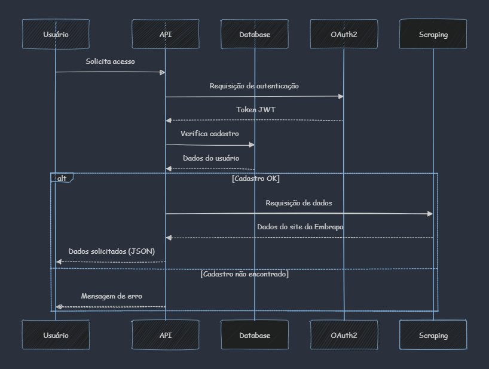
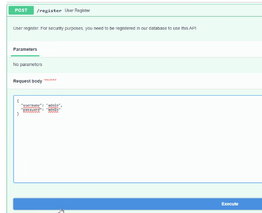
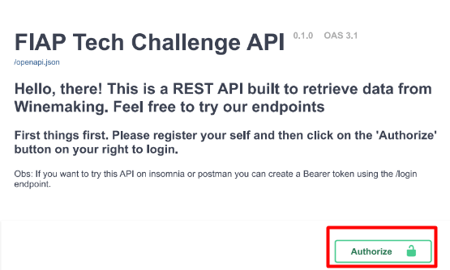

# API para Consulta dos Dados de Vitivinicultura da Embrapa
API desenvolvida para consulta dos dados de Produção, Processamento, Comercialização, Importação e Exportação do site http://vitibrasil.cnpuv.embrapa.br/.

 
## Overview

O site de Vitivinicultura da Embrapa apresenta informações sobre a quantidade de uvas processadas, produção e comercialização de vinhos, suco e derivados provenientes do Estado do Rio Grande do Sul, além dos dados de importação e exportação dos produtos. 

A janela de tempo dos dados atualmente varia de 1970 até 2023.

**Vitivinicultura:** Ciência que estuda a produção da uva.


### ✔️ Arquitetura do Projeto (Diagrama de Sequência - UML)

<div style="margin-left: auto;
            margin-right: auto;
            width: 100%;">



</div>

<!-- Este diagrama foi gerado utilizando a sintaxe do Mermaid -->

## 🛠️ Desenvolvimento da API

- API desenvovida em Python com o Framework FastAPI. 

- Como método de autenticação, emprega-se o *Json Web Token* (JWT) com OAuth2. Permite que os usuários façam login e autentiquem suas soicitações usando tokens JWT.  Os dados de cadastros dos usuários são armazenados no PostgreSQL (SQLAlchemy).

- Utiliza os pacotes Requests e BeautifulSoup para fazer o *Web Scraping* do site http://vitibrasil.cnpuv.embrapa.br/, obter os dados e fazer o parsing dos dados de maneira estrturada. 

- Para validar os dados e garantir a consistência dos dados utilizou-se o Pydantic.

- O Swagger foi utilizado para a documentar a API. \
Para consultar a aplicação/documentação, acessar:
http://localhost:4000/docs.

- A cada requisição GET o processo de *Web Scraping* se repete e retorna os dados em formato Json, que favorece o armazenamento e a construção de modelos estatísticos.

- O Docker foi usado para fazer o deploy e facilitar a distribuição da API.

### Rota dos Dados:

1. **Produção:**

```bash
    /producao/{first_year}:{last_year}
```

2. **Processamento:**

```bash
    /processamento/{first_year}:{last_year}
```
3. **Comercialização:**

```bash
    /comercializacao/{first_year}:{last_year}
```
4. **Importação:**

```bash
    /importacao/{first_year}:{last_year}
```
5. **Exportação:**

```bash
    /exportacao/{first_year}:{last_year}
```

### Parâmetros

Parâmetros para definir o intervalo dos dados (anos) na consulta:
  > first_year: ano inicial;\
  > last_year: ano final.

📍 A janela máxima de tempo dos dados está contido entre 1970 e 2024.


## 📝 Criação de cadastro para acessar os dados

- Para acessar os dados é necessário criar usuário e senha, para isso, basta acessar o **endpoint de registro**, preencher os campos e executar, como na imagem :

<center>

| Parâmetro | Valor  |
| --------  | ------ |
| username  | string |
| password  | string |

</center>

<div style="margin-left: auto;
            margin-right: auto;
            width: 75%">

 

</div>

- Depois de efetuar o cadastro, realizar o Login clicando em *Authorize*:

<div style="margin-left: auto;
            margin-right: auto;
            width: 70%;">



</div>

  Para a Autenticação preencher somente os campos de usuário e senha, com as informações cadastradas anteriormente, e autenticar. Após esse passo o usuário está apto a acessar os endpoints e selecionar os dados de interesse.


## 🚀 Deploy da API

### 📍 Pré-requisitos: Docker.

### 📝 Tutorial API

1. **Clonar o repositório ou fazer download do projeto:**

```bash
  $ git clone
```

2. **Entrar no diretório do projeto:**

```bash
  $ cd diretorio_projeto
```

3. **Executa a API:**

```bash
  (project_root)$ docker-compose up --build
```


## Melhorias

- Armazenamento dos dados em um banco de dados.
 
## Autores
- Marcelo Felix
- Denise Oliveira
 

